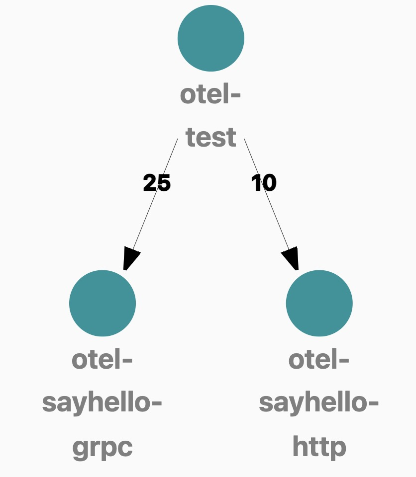

# otel-test
This project contains a complete example of golang using OpenTelemetry. 

It including 3 services:
* otel-test 
* otel-sayhello-grpc
* otel-sayhello-http.

The calling relationship is as shown below

This project shows how the following libraries use otelemetry:
* `go-redis`
* `net/http`
* `gin`
* `grpc`

## docker-compose
docker-compose contains `Jaeger`,`Prometheus`,`Grafana`,`OpenTelemetry-Collector`.
[docker-compose](https://github.com/vearne/otel-test/tree/master/docker-compose)
